# Design Pattern App

The Design Pattern App is a Java application that demonstrates the implementation of several design patterns. It showcases the usage of the following design patterns:

- Chain of Responsibility
- Command
- Observer
- Strategy

## Overview

The application provides a practical demonstration of these design patterns in action. Each pattern is implemented using the appropriate classes and interfaces, showcasing their key concepts and usage scenarios.

## Features

- **Chain of Responsibility**: Illustrates a chain of handlers where a request is passed through each handler until it is handled appropriately or reaches the end of the chain.
- **Command**: Demonstrates the encapsulation of requests as objects, separating the sender from the receiver and enabling flexible execution of different commands.
- **Observer**: Shows the one-to-many dependency between objects, where multiple observers are notified and updated when the state of the subject changes.
- **Strategy**: Exhibits the ability to select and switch between interchangeable strategies at runtime, enabling dynamic behavior changes.

## Implementation

### Chain of Responsability

The Chain of Responsibility pattern allows passing a request along a chain of potential handlers, where each handler decides whether to handle the request or pass it to the next handler in the chain. In this application, the `Handler`, `ConcreteHandler1`, and `ConcreteHandler2` classes demonstrate the Chain of Responsibility pattern.

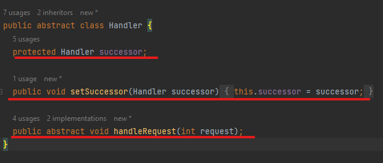
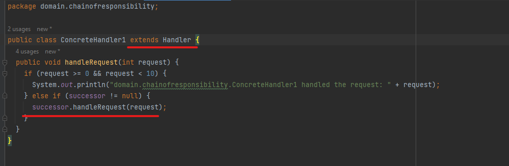
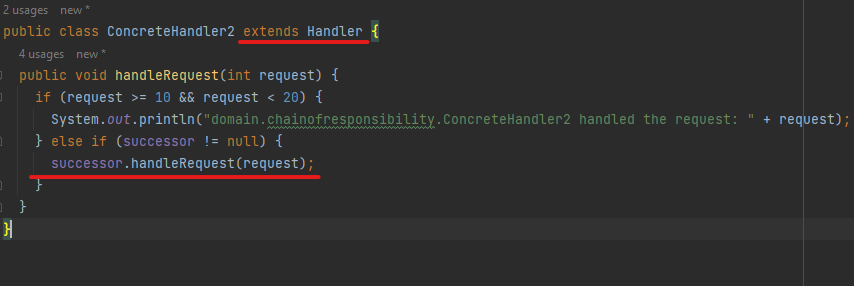

### Command

The Command pattern encapsulates requests or operations as objects, allowing the separation of the sender (invoker) of the request from the object that performs the action (receiver). In this application, the `Command`, `ConcreteCommand`, and `Receiver` classes showcase the Command pattern.

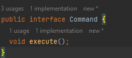
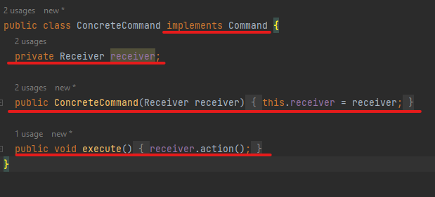
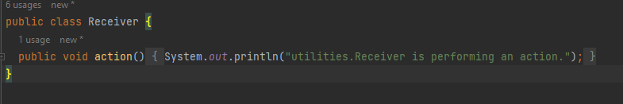

### Observer

The Observer pattern defines a one-to-many dependency between objects, where multiple observers can be notified and updated when the state of the subject changes. The application demonstrates the Observer pattern with the `Observer`, `ConcreteObserver`, and `Subject` classes.

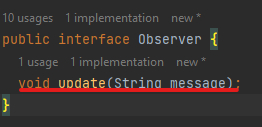
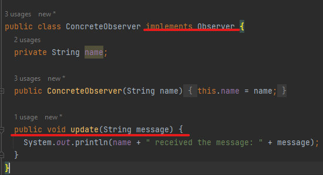
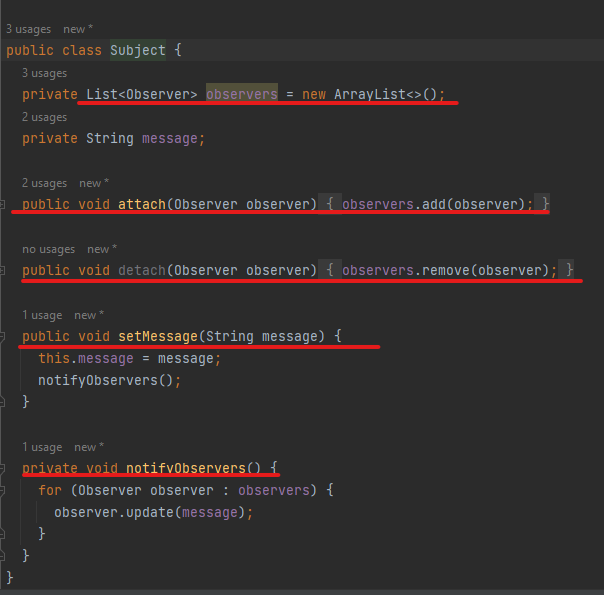

### Strategy 

The Strategy pattern enables the selection of an algorithm at runtime from a family of interchangeable strategies. This application showcases the Strategy pattern with the `Strategy`, `ConcreteStrategy1`, and `ConcreteStrategy2` classes.

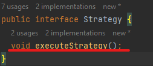
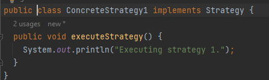
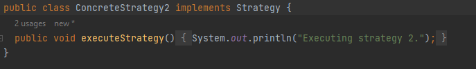